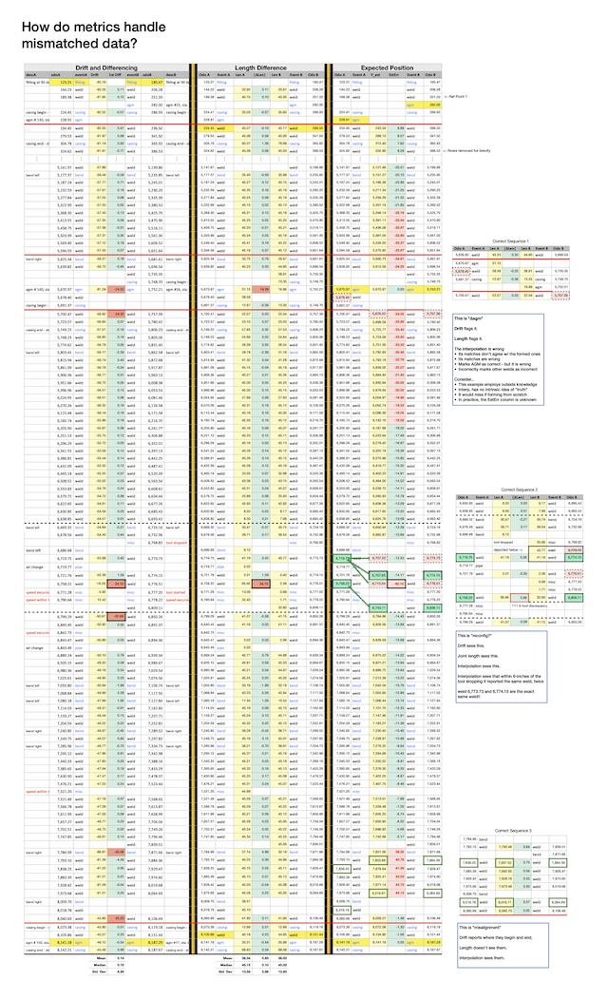

# Drift-Metric-Files
**Data and code supporting :**
*Using odometry drift to match ILI joint boundaries for run comparisons*
by: Craig L Champlin
in: <u>International Journal of Pressure Vessels and Pipelines</u>
February 2025

https://doi.org/10.1016/j.ijpvp.2024.105351

## Reconfiguration Example Sec 6.1

The graphical abstract uses this data.

### Data for reconfiguration example

- Apple Numbers Spreadsheet: [./Drift Paper Section 6.1.numbers](<./Drift Paper Section 6.1.numbers>)
- Excel Spreadsheet: [./Drift Paper Section 6.1.xlsx](<./Drift Paper Section 6.1.xlsx>)
- Comma Separated Values: [./Drift Paper Section 6.1.csv](<./Drift Paper Section 6.1.csv>)
- PDF Print of Apple Spreadsheet: [./Drift Paper Section 6.1.pdf](<./Drift Paper Section 6.1.pdf>)

## Drift Differencing vs Zippering Example Sec 6.3

This is the data from Section 6.3.1. 

- Apple Numbers Spreadsheet: [./Drift Paper Section 6.3.numbers](<./Drift Paper Section 6.3.numbers>)
- Excel Spreadsheet: [./Drift Paper Section 6.3.xlsx](<./Drift Paper Section 6.3.xlsx>)
- Comma Separated Values: [./Drift Paper Section 6.3.csv](<./Drift Paper Section 6.3.csv>)
- PDF Print of Apple Spreadsheet: [./Drift Paper Section 6.3.pdf](<./Drift Paper Section 6.3.pdf>)

README.assets/Synthetic Example with Outliers v9.png

All the data and results for the 

Contains two (nearly) identical spreadsheets with the examples from region 2.

1. \*.numbers - Apple Numbers version, contains the regional graph
2. \*.xlsx - Excel version, no graph

Contains a side-by-side comparison of drift, joint length, and interpolation and how they address the examples from Region Two in the paper.

**Preview of Spreadsheets**

